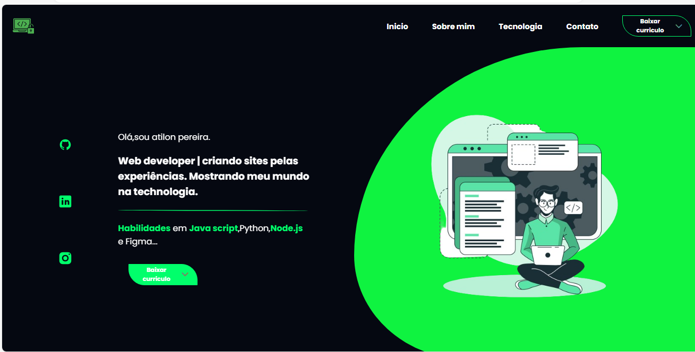

# conhe/a meu portifolio profissional
 
<h2>ola,eu sou atilon pereira criador de sites hoje quero  lhe mostar meu portifolio.</h2>
<h3>o que e um portifolio</h3>

site profissional que mostrar suas habilidades e demonstra sua vida no mundo da technologia.Em um portifolio pode conter seu contato,nome,com o que trabalha e falando sobre sua area de trabalho.alem de divulgar suas redes sociais e mostar seu potencial na technologia,pois o portifolio e um local aonde voce tem o objetivo de colocar todo seu conhecimento em web desgner e em site.

 
<h2>meu portifolio</h2>

responsivo para mobile,tablet e principalmente para pc.

  <a href="#">acessar portifolio</a>

nessa parte do site e umas da partes mais importante.ela deve mostrar os links de navega/ao do site e deve conter um desgner chamativo que atraia o recrutador.nesse portifolio foi adicionado cor chamtiva que e o verde e adicionado buttoes de interatividade de downloads e efeitos nos links.alem de conetr imagen que e muito impoetante.o layout possui uma navega/ao no top e na section conten duas parte,a primeira mostra meu nome e minhas redes e a seuguna resalta um imagen que combina com o fundo.

<a href="#">saiba mais</a>

<h2>adicionamento da timeline</h2>

a segunda parte quiz fazer aulgo diferente mais criativo,sendo a di/ao da timeline.a timeline foi feita de um jeito mais profissional e contudo animada ao acontecer o scoll da tela em certos pontos do site.

